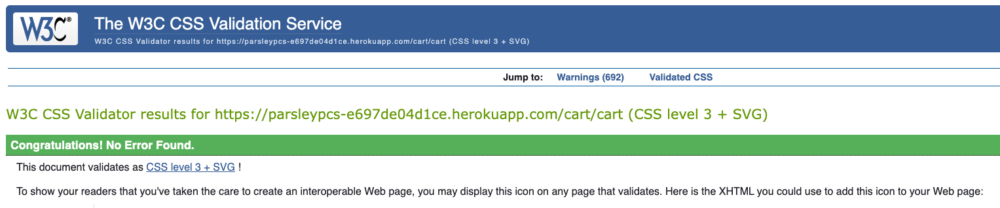
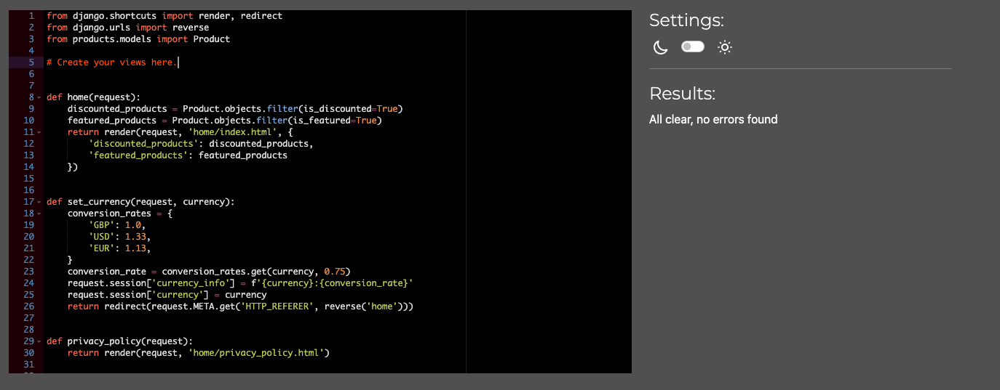
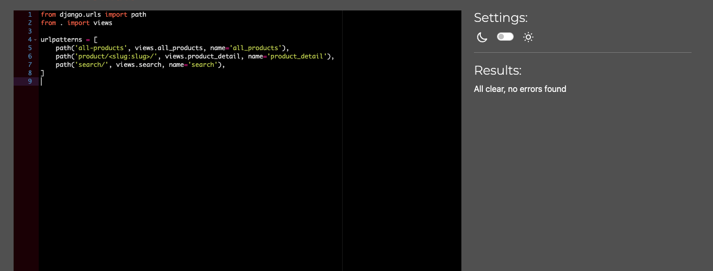

<div align=center>

</div>

# [Parsley PCs]()

 


 

This is a project for the Code Institute Milestone Project 4. Parsley PCs is an e-commerce site that enables users to purchase individual computer parts.

The users of this website will be able to create an account, browse current available products and offers, and interactively build a PC with parts of their choice that can be built and delivered to them.

The users will be able to create accounts and track their cart/orders, or simply browse and purchase items as a guest.

View the live project [Here!](https://parsleypcs-e697de04d1ce.herokuapp.com/)

---

## Table of Contents
1. [**UX**](#ux)
    - [**User Stories**](#user-stories)
    - [**Design**](#design)
        - [**Color Scheme**](#color-scheme)
        - [**Imagery**](#imagery)
        - [**Typography**](#typography)
    - [**Wireframes**](#wireframes)
    - [**Database Design**](#database-design)
2. [**Technologies Used**](#technologies-used)
    - [**Development Technologies**](#development-technologies)
    - [**Front-End Technologies**](#front-end-technologies)
    - [**Back-End Technologies**](#back-end-technologies)
    - [**Python Modules**](#python-modules)
    - [**Deployment Technologies**](#deployment-technologies)
3. [**Testing**](#testing)
    - [**Automated Testing**](#automated-testing)
        - [**Unit Tests**](#unit-tests)
        - [**Integration Tests**](#integration-tests)
        - [**Testing with Coverage**](#testing-with-coverage)
    - [**Manual Testing**](#manual-testing)
    - [**Validation**](#validation)
    - [**Compatibility**](#compatibility)
4. [**Deployment**](#deployment)
    - [**Steps for Deployment**](#steps-for-deployment)
        - [**AWS S3 Bucket Setup for Media Files**](#aws-s3-bucket-setup-for-media-files)
            - [**1. Create an AWS Account**](#1-create-an-aws-account)
            - [**2. Create an S3 Bucket**](#2-create-an-s3-bucket)
            - [**3. Set Bucket Policy**](#3-set-bucket-policy)
            - [**4. Create an IAM User**](#4-create-an-iam-user)
        - [**Set up Heroku Deployment**](#set-up-heroku-deployment)
            - [**1. Create a Heroku Account**](#1-create-a-heroku-account)
            - [**2. Install Heroku CLI**](#2-install-heroku-cli)
            - [**3. Deploy to Heroku**](#3-deploy-to-heroku)
                - [**Create a Heroku App**](#create-a-heroku-app)
                - [**Push Your Project to Heroku**](#push-your-project-to-heroku)
                - [**Set Up Heroku Config Vars**](#set-up-heroku-config-vars)
                - [**Run Migrations**](#run-migrations)
                - [**Create a Superuser**](#create-a-superuser)
                - [**Collect Static Files**](#collect-static-files)
                - [**Open Your App**](#open-your-app)
5. [**Credits**](#credits)
    - [**Tools And Software**](#tools-and-software)
    - [**Media**](#media)


---

## UX

### User Stories

I have decided to place the user inside a table for good structure.

The table depicts three groups:

- **Guest User** - Someone who has not yet created an account on the site.

- **Registered User** - Someone who has created an account and activated it using the email link.

- **Site Admin** - Someone who has control over the site with an admin log in, they are able to manage the site unlike the previous two groups.

| **ID** | **As** | **I want to be able to** | **In order to** |
|:---:|:---:|:---:|:---:|
| **1** | **Guest User** | View the site irrespective of the browser/device I am using | Be able to view all required information |
| **2** | **Guest User** | View the site's available products and their information | View the purchasable items |
| **3** | **Guest User** | Sort the site's shop by order of popularity | View the most popular items first |
| **4** | **Guest User** | Sort the items by their specific category | View the items I am most interested in buying |
| **5** | **Guest User** | Add items to my cart | Purchase my chosen items and view a running total spend |
| **6** | **Guest User** | Remove items from my cart | Cancel a purchase on a specific item |
| **7** | **Guest User** | Create an account | Have a personalised shopping experience and saved information |
| **8** | **Guest User** | View each product in detail | Gain more insight into a specific product before purchase |
| **9** | **Guest User** | Interactively build my own PC | Gain an idea as to what the final product would be |
| **10** | **Guest User** | View featured or reduced deals | Get the best deals available on the site |
| **11** | **Guest User** | Search for products on the site | Find a specific item |
| **12** | **Guest User** | View related products to the one I am looking at | Find potentially better deals or suitability and compare the results |
| **13** | **Guest User** | View my current search and how many results were returned | Gain an insight into the usefulness of the search |
| **14** | **Guest User** | Easily update the items/quantity in my shopping bag | Make changes to my purchases |
| **15** | **Guest User** | Input my payment details when confirming a purchase | Pay for the items in my shopping bag |
| **16** | **Guest User** | Receive a confirmation email after placing an order (with option to provide email address) | Have peace of mind that my order was received |
| **17** | **Registered User** | Manage my account, such as username, address or name | Be able to keep my information up to date |
| **18** | **Registered User** | Change or reset my password | Access my account if the password is forgotten or stolen |
| **19** | **Registered User** | Delete my account | Remove my personal information from the site |
| **20** | **Registered User** | Add a review to an item | Provide feedback for the store owner and for other shoppers |
| **21** | **Registered User** | Save my delivery address for further potential purchases | Have an easy experience if I return to the site |
| **22** | **Registered User** | Delete a review I have previously posted | Remove my opinion from the product |
| **23** | **Registered User** | Update or edit a review posted by myself | Change a potential mistake in my review |
| **24** | **Site Admin** | Add an item to the store along with a picture | Add fresh or updated products to the store |
| **25** | **Site Admin** | Update an items on the store | Change the price or add more information such as an updated picture |
| **26** | **Site Admin** | Remove or hide items from the store  | Control what is available on the store currently |
| **27** | **Site Admin** | Update the site's terms and conditions, or other information such as banners | Ensure customers are updated on potential issues or specific sales |
| **28** | **Site Admin** | Add/Remove/Update categories of items | Ensure that there is a category readily available and suitable for each product |
| **29** | **Site Admin** | View all orders along with their completion status | Manage each order and ensure they are completed correctly |
| **30** | **Site Admin** | Manage reviews posted by users | Moderate the content, such as removing hateful or discrimatory messages |
| **31** | **Site Admin** | Manage user accounts | Aid users that are having issues with their personal accounts |

### Design

This web application will be designed to have a professional feel to it, with hints of technology dotted around.

#### Color Scheme

To keep in line with the name and theme, the app will follow a colour scheme extracted from the following logo image.

<div align=center>
    
</div>

*Palette*: **Extracted From Above Image**

| 1 | 2 | 3 | 4 | 5 | 
| :---: | :---: | :---: | :---: | :---: |
|  |  |  |  |  |
| #2B2A40 | #435C73 | #618C74 | #94A69B | #6D8C3F |

The above table was extracted from the image using [Adobe Color](https://color.adobe.com/create/image) by uploading the image and selecting the colours extracted from the image.

These will be placed as *:root* variables within the base css file in order to be used across all necessary elements.

#### Imagery

Any imagery used on the website will be follow a technological theme in lieu with the site's products.

Registered users of the site will be able to upload their own image in order to have a personalised profile picture.

The images of the products will all follow the same theme and style to ensure consistency across the products pages.

#### Typography

The main font that will be seen across the site is [Oswald](https://fonts.google.com/specimen/Oswald).

A fall-back font of sans-serif will be used upon failure to load the main font style.

### Wireframes

#### Home Page

The home page will introduce a user to the site's main prupose, as well as providing easy navigation elements to all other pages within the site. Featured products will also be available on the home page to entice users to click on said products initially.

<div align=center>
    
</div>

#### All Products Page

The all products page will have all products returned based on a filter. users can sort, filter and change which types of products show up on this page.

The products will be in their own individual cards and laid on the page using the bootstrap grid system.

<div align=center>
    
</div>

#### Build Your Own Page

The 'Build Your Own' page will be the main focus of the site, and will allow users to interactively build their own PC. 

Users will be able to drag and drop products onto the PC in order of assembly. The products they chose will automatically update their cart so that they can purchase all of the required products, or pay a small fee at the end of building to have the PC built for them.

When chosing parts for the PC, only parts that are compatible with the previously selected components will be available.

<div align=center>
    
</div>

### Database Design

This entity relationship diagram represents the relationships users, products and all additional information to be captured alongside them.

As different PC parts will require different technical paramaters, class inheritence was used in this diagram to represent fields that will be present for each product, as well as the specific required technical fields for each type of PC Component.

<div align=center>
    
</div>

## Technologies Used

### Development Technologies

- 
    - [Balsamiq](https://balsamiq.com/) - Balsamiq was used in order to create intuitive wireframes during the initial design process.
- 
    - [GitHub](https://github.com/) - GitHub was used to store and manage the project within a combined online repository.
- 
    - [VS Code](https://code.visualstudio.com/) - Visual Studio Code was used as the primary development environment for the project.

### Front-End Technologies

- 
    - [HTML5](https://developer.mozilla.org/en-US/docs/Web/Guide/HTML/HTML5) - HTML5 was used as the primary markup language in order to structure and display the elements on the page.
- 
    - [CSS3](https://developer.mozilla.org/en-US/docs/Web/CSS/CSS3) - CSS Was used in order to provide styling to the web pages with custom colours and sizes of elements.
- 
    - [Bootstrap 4.3.1](https://getbootstrap.com/docs/4.3/getting-started/introduction/) - Bootstrap was used to quickly design and create the layout and look of the website.
- 
    - [jQuery 3.3.1](https://code.jquery.com/jquery/) - jQuery was used in conjunction with bootstrap to apply javascript selectors and updating elements more efficiently.

### Back-End Technologies

- 
    - [Python 3.11.2](https://www.python.org/) - Python was used as the back-end management language to pass and handle data to and from the application.
- 
    - [Django 3.2](https://www.djangoproject.com/) - Django is a high-level Python web framework that encourages rapid development and clean, pragmatic design. It was used to build the back-end of the application.
- 
    - [PostgreSQL 16.1](https://www.postgresql.org/) - PostgreSQL was used as the database in this project in order to store information regarding users, products, and orders.

### Python Modules

In this section I will highlight and explain the use of each additional python package that was used within this project.

- 
    - [Django AllAuth 0.44.0](https://django-allauth.readthedocs.io/en/latest/) - Django AllAuth was used to manage user registrations, logins, and authentication.
- 
    - [Whitenoise 5.3.0](http://whitenoise.evans.io/en/stable/) - Whitenoise was used to serve static files in production.
- 
    - [Gunicorn 20.1.0](https://gunicorn.org/) - Gunicorn was used as the WSGI HTTP server for serving the Django application in production.
- 
    - [Boto3 1.18.57](https://boto3.amazonaws.com/v1/documentation/api/latest/index.html) - Boto3 was used to interact with AWS S3 for storing media files.

### Deployment Technologies

- 
    - [Heroku](https://www.heroku.com/) - Heroku was used to deploy and host the application in the cloud.
- 
    - [AWS S3](https://aws.amazon.com/s3/) - AWS S3 was used to store and serve static and media files.

## Testing

Testing was a crucial part of the development process to ensure that the application works as expected and provides a good user experience. The following testing strategies were used:

### Automated Testing

Automated testing was performed using Django's built-in testing framework. The following types of tests were implemented:

1. #### Unit Tests: 
    - **Models**: Tests were written to ensure that all models behave as expected, including proper field validation and relationships.
    - **Views**: Tests were created to check that views return the correct responses and render the appropriate templates.
    - **Forms**: Form tests were conducted to validate form data and ensure that form submissions work correctly.

2. #### Integration Tests:
    - **User Authentication**: Tests were written to verify the user registration, login, and logout functionalities.
    - **Product Management**: Tests were implemented to ensure that product creation, updating, and deletion work correctly.

To run the automated tests, the following command was used:

```bash
python manage.py test
```

#### Testing with Coverage

To ensure comprehensive testing of the Django project, the `coverage` tool was used.  
The steps below highlight how the coverage tests were ran:

##### Step 1: Install Coverage

Coverage was first installed using the following command

```bash
pip install coverage
```

##### Step 2: Run Tests with Coverage

From the root directory of the project, the following command was used in order to create a coverage test state

```bash
coverage run --source='.' manage.py test
```

##### Step 3: Generate Coverage Report

The report from the coverage testing was acquired using the following command.

```bash
coverage report
```

##### Example Coverage Output

```bash
Name                                             Stmts   Miss  Cover
--------------------------------------------------------------------
cart/__init__.py                                     0      0   100%
cart/admin.py                                        3      0   100%
cart/apps.py                                         4      0   100%
cart/context_processors.py                          16      0   100%
cart/migrations/0001_initial.py                      7      0   100%
cart/migrations/0002_alter_cartitem_user.py          6      0   100%
cart/migrations/0003_cartitem_session_key.py         4      0   100%
cart/migrations/__init__.py                          0      0   100%
cart/models.py                                      15      1    93%
cart/tests.py                                       60      0   100%
cart/urls.py                                         3      0   100%
cart/views.py                                       56     11    80%
checkout/__init__.py                                 0      0   100%
checkout/admin.py                                    3      0   100%
checkout/apps.py                                     4      0   100%
checkout/forms.py                                    6      0   100%
checkout/migrations/0001_initial.py                  7      0   100%
checkout/migrations/0002_auto_20240707_2157.py       5      0   100%
checkout/migrations/0003_auto_20240710_1959.py       4      0   100%
checkout/migrations/0004_order_session_key.py        4      0   100%
checkout/migrations/0005_alter_order_user.py         6      0   100%
checkout/migrations/0006_auto_20240711_2100.py       4      0   100%
checkout/migrations/__init__.py                      0      0   100%
checkout/models.py                                  18      0   100%
checkout/tests.py                                   45      0   100%
checkout/urls.py                                     3      0   100%
checkout/views.py                                   54     13    76%
env.py                                              10      5    50%
home/__init__.py                                     0      0   100%
home/admin.py                                        1      0   100%
home/apps.py                                         4      0   100%
home/middleware.py                                  15      0   100%
home/migrations/__init__.py                          0      0   100%
home/models.py                                       1      0   100%
home/templatetags/__init__.py                        0      0   100%
home/templatetags/currency.py                       15      2    87%
home/templatetags/custom_filters.py                  5      0   100%
home/tests.py                                       41      0   100%
home/urls.py                                         3      0   100%
home/utils.py                                        2      2     0%
home/views.py                                       19      3    84%
manage.py                                           11      2    82%
parsleypcs/__init__.py                               0      0   100%
parsleypcs/asgi.py                                   4      4     0%
parsleypcs/settings.py                              49     30    39%
parsleypcs/urls.py                                   6      0   100%
parsleypcs/wsgi.py                                   4      4     0%
products/__init__.py                                 0      0   100%
products/admin.py                                   15      0   100%
products/apps.py                                     4      0   100%
products/forms.py                                   10      0   100%
products/migrations/0001_initial.py                  6      0   100%
products/migrations/0002_auto_20240624_1354.py       4      0   100%
products/migrations/0003_product_rating.py           4      0   100%
products/migrations/0004_case_storage.py             5      0   100%
products/migrations/__init__.py                      0      0   100%
products/models.py                                 125      6    95%
products/tests.py                                   93      0   100%
products/urls.py                                     3      0   100%
products/views.py                                   38      3    92%
profiles/__init__.py                                 0      0   100%
profiles/admin.py                                    3      0   100%
profiles/apps.py                                     4      0   100%
profiles/forms.py                                    6      0   100%
profiles/migrations/0001_initial.py                  7      0   100%
profiles/migrations/0002_auto_20240711_2105.py       4      0   100%
profiles/migrations/__init__.py                      0      0   100%
profiles/models.py                                  16      0   100%
profiles/tests.py                                   50      0   100%
profiles/urls.py                                     3      0   100%
profiles/views.py                                   16      0   100%
--------------------------------------------------------------------
TOTAL                                              943     86    91%
```

As we can see there was a total coverage of 91% with most files being fully tested, therefore I have confidence that my views, models and forms work as expected.

### Manual Testing

In addition to automated testing, manual testing was performed to ensure that the application functions correctly.

### Validation

### HTML Validation

The sites HTML content was validated using the [W3C HTML](https://validator.w3.org/) Validator. As the validator does not recognise the Django templating language, the pages were checked via their URL's once the project was deployed.

Any errors that were identified were rectified, and checked again once the project was redeployed.

It was not possible to test all pages as the validator would not have access to an account or be able to place an order.

<details>
<summary>CLICK HERE to view screenshots of the html validation pages</summary>


</details>

### CSS Validation

The CSS was checked using the [W3C CSS](https://jigsaw.w3.org/css-validator/#validate_by_uri) Validation service and returned no critical errors.

Warnings were returned, however these were due to rules such as `-webkit-text-size-adjust` being vendor extensions.

<details>
<summary>CLICK HERE to view screenshots of the css validation pages</summary>





</details>

### Python Validation

The python files were tested using the CI Python Linter. Each file was tested and adjusted if it didn't conform to PEP8 standards. I have split each section down into dropdowns below.

<details>
<summary>ParsleyPCs (Main Files)</summary>


</details>

<details>
<summary>Cart App</summary>

**Admin**

**Apps**

**Context processors**

**Models**

**Tests**

**URLs**

**Views**


</details>

<details>
<summary>Checkout App</summary>

**Admin**

**Models**

**Tests**

**URLs**

**Views**


</details>

<details>
<summary>Home App</summary>

**Middleware**

**URLs**

**Views**


</details>

<details>
<summary>Products App</summary>

**Models**

**URLs**

**Views**


</details>

**Page Speed Insights**

The [Page Speed Insights](https://pagespeed.web.dev/analysis/https-trelawney-crafts-174a0a88326e-herokuapp-com/dx9d990dv4?form_factor=desktop) tool was used in order to check the website against different criteria to ensure it performs well, is suitably accessible and performs well.

Please see the screenshot below for the returned scores.

<p align="center">

</p>

I believe the site's low performance is due to the product images that are displayed on most pages. The images uploaded for products were not optimised for web display with some having rather large file sizes.


### Compatibility

The sites compatability was tested across multiple devices, using my own personal devices, those of friends & family, as well as emulated devices.

Below is a testing matrix created in order to show what tests were conducted across devices and web browsers

| Colour | Meaning |
|:---:|:---:|
|  | Works Perfectly, No Immediate Issues |
|  | Works mostly as intended |
|  | Contains some issues |

| Browser | Device | Responsive | Links Work As Intended | Images Displayed | Back End Functionality | Easily Navigable |
|:---:|:---:|:---:|:---:|:---:|:---:|:---:|
| Chrome | iPhone 12 |  |  |  |  |  |
| Chrome | MacBook Pro |  |  |  |  |  |
| Chrome | Windows Laptop |  |  |  |  |  |
| Safari | MacBook Pro |  |  |  |  |  |
| Safari | iPhone 12 |  |  |  |  |  |
| Firefox | Raspberry Pi |  |  |  |  |  |
| Chromium | Raspberry Pi |  |  |  |  |  |

## Deployment

The project was deployed using Heroku, a platform-as-a-service (PaaS) that enables developers to build, run, and operate applications entirely in the cloud.

### Steps for Deployment

#### AWS S3 Bucket Setup for Media Files

To store media files on AWS S3, follow these steps:

##### 1. Create an AWS Account
   - If you don't already have an AWS account, create one at [AWS](https://aws.amazon.com/).

##### 2. Create an S3 Bucket
   - Go to the S3 service in the AWS Management Console and create a new bucket.
   - Choose a globally unique name for your bucket.
   - Select the region closest to your application server for optimal performance.
   - Uncheck "Block all public access" to ensure media files can be accessed publicly.

##### 3. Set Bucket Policy
   - Set a bucket policy to allow public read access to your files.
   - Example bucket policy:
```json
   {
       "Version": "2012-10-17",
       "Statement": [
           {
               "Sid": "PublicReadGetObject",
               "Effect": "Allow",
               "Principal": "*",
               "Action": "s3:GetObject",
               "Resource": "arn:aws:s3:::your-bucket-name/*"
           }
       ]
   }
```

##### 4. Create an IAM User
   - Go to the IAM service in the AWS Management Console and create a new user.
   - Attach the `AmazonS3FullAccess` policy to this user to give full access to S3.


#### Set up Heroku Deployment

#### 1. **Create a Heroku Account**
   - Go to [Heroku](https://www.heroku.com/) and create an account if you don't already have one.

#### 2. **Install Heroku CLI**
   - Install the Heroku CLI on your machine. You can follow the instructions provided on the [Heroku Dev Center](https://devcenter.heroku.com/articles/heroku-cli).


#### 3. **Deploy to Heroku**

##### Create a Heroku App
   - Use the Heroku CLI to create a new app.

   ```bash
   heroku create parsleypcs
   ```

##### Push Your Project to Heroku
   - Deploy your project to Heroku by pushing your code.

   ```bash
   git push heroku main
   ```

##### Set Up Heroku Config Vars
   - Set up your environment variables in Heroku. This includes `SECRET_KEY`, `DEBUG`, `DATABASE_URL`, and any other variables your project requires.

   ```bash
    heroku config:set SECRET_KEY='your-secret-key'
    heroku config:set DEBUG='True'
    heroku config:set STRIPE_PUBLIC_KEY='your-stripe-public-key'
    heroku config:set STRIPE_SECRET_KEY='your-stripe-secret-key'
    heroku config:set DATABASE_URL='your-database-url'
    heroku config:set AWS_ACCESS_KEY_ID='your-aws-access-key-id'
    heroku config:set AWS_SECRET_ACCESS_KEY='your-aws-secret-access-key'
    heroku config:set AWS_STORAGE_BUCKET_NAME='your-aws-storage-bucket-name'
    heroku config:set AWS_S3_REGION_NAME='your-aws-s3-region-name'
   ```

   This step can also be done under the 'Settings' Page inside the app on your web browser.

##### Run Migrations
   - Apply the database migrations on Heroku.

   ```
   heroku run python manage.py migrate
   ```

##### Create a Superuser
   - Create a superuser to access the Django admin on the deployed site.

   ```
   heroku run python manage.py createsuperuser
   ```

##### Collect Static Files
   - Collect static files to ensure they are served correctly in production.

   ```
   heroku run python manage.py collectstatic
   ```

##### Open Your App
   - Open the deployed app in a web browser.

   ```
   heroku open
   ```

The Django application should now be successfully deployed on Heroku and configured to use AWS S3 for media file storage.

## Credits

### Tools And Software

These different tools were used either in the development or documentation processes.

[Tables Generator](https://www.tablesgenerator.com/markdown_tables) - This website was used in order to easily design the tables used in this README.md document.

[Shields IO](https://shields.io/) - Used in order to place the badges seen within this README.

[Balsamiq](https://balsamiq.com/) - This piece of software was used in order to create the wireframes shown in the [design](#design) section.

[Adobe Color](https://color.adobe.com/create/image) -  Was used in order to extract the sites colour scheme from the images.

[Lucid Chart](https://www.lucidchart.com/pages/landing?utm_source=google&utm_medium=cpc&utm_campaign=_chart_en_tier1_mixed_search_brand_exact_&km_CPC_CampaignId=1490375427&km_CPC_AdGroupID=55688909257&km_CPC_Keyword=lucid%20charts&km_CPC_MatchType=e&km_CPC_ExtensionID=&km_CPC_Network=g&km_CPC_AdPosition=&km_CPC_Creative=442433236001&km_CPC_TargetID=kwd-64262996435&km_CPC_Country=1006818&km_CPC_Device=c&km_CPC_placement=&km_CPC_target=&gad_source=1&gclid=CjwKCAiAq4KuBhA6EiwArMAw1EPQV211KvYtjxyuul8wxZInPFwWe86MEzyW9NiFahIk84N9eQe04BoC6f8QAvD_BwE) - Was used in order to create the database diagram within the [database design](#database-design)

### Media

Images used for the default/demo products were taken from the Amazon.co.uk website.